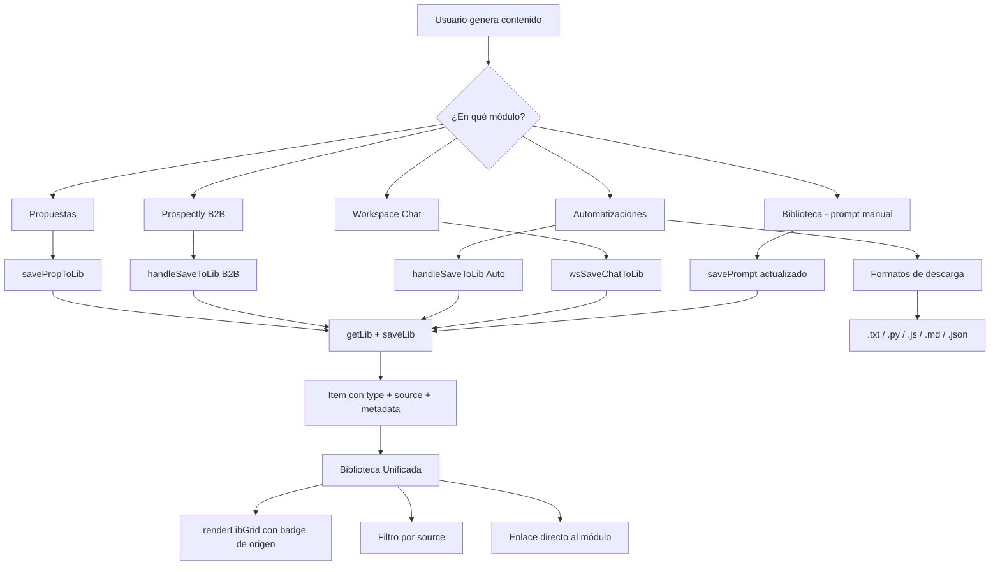

# Plan: Biblioteca Unificada — Guardar desde cualquier módulo

## Objetivo

Convertir la Biblioteca en un repositorio central donde cualquier contenido generado por el usuario (propuestas, kits B2B, automatizaciones, chats de equipos) pueda guardarse y consultarse desde un único lugar, además de desde su módulo de origen.

---

## Diagnóstico actual

| Módulo | Botón "Guardar en Biblioteca" | Estado |
|--------|-------------------------------|--------|
| **Propuestas** | `saveCurrentProp()` guarda en `propDB` (historial propio). No hay botón para guardar en la Biblioteca de prompts. | ❌ No existe |
| **Prospectly B2B** | Solo botones "Copiar todo" y "Exportar JSON". No hay guardado en Biblioteca. | ❌ No existe |
| **Automatizaciones** | Solo botones "Copiar" y "↓ .txt". No hay guardado en Biblioteca. | ❌ No existe |
| **Workspace (chats)** | `workspaceHistory.save()` guarda historial propio (solo Pro). No hay guardado en Biblioteca. | ❌ No existe |
| **Biblioteca (prompts)** | Modal `modal-prompt` con título, categoría, contenido, tags. Guarda en `getLib()` / `saveLib()`. | ✅ Existe |

---

## Nueva estructura de datos de la Biblioteca

Se modifica la estructura de cada item para incluir `type` (origen del contenido) y `metadata` (datos adicionales según el origen).

### Estructura actual (a migrar)

```javascript
{
  id: genId(),
  title: string,
  content: string,
  category: string,     // 'system' | 'tarea' | 'crm' | 'contenido' | 'codigo' | 'estrategia' | 'otro'
  tags: string[],
  createdAt: fmtDate()
}
```

### Nueva estructura unificada

```javascript
{
  id: genId(),
  type: string,           // 'prompt' | 'propuesta' | 'b2b' | 'automatizacion' | 'chat'
  title: string,
  content: string,
  category: string,       // misma clasificación visual existente
  tags: string[],
  createdAt: fmtDate(),
  source: string,         // 'manual' | 'propuesta' | 'prospectly-b2b' | 'prospectly-auto' | 'workspace'
  sourceId: string|null,  // ID del elemento en su módulo de origen (si aplica)
  metadata: {             // datos adicionales según el origen
    // Para propuestas:
    //   servicio, nombre, empresa, precio, status, clienteId
    // Para B2B:
    //   target, industry, tone
    // Para Automatizaciones:
    //   type (código/script/comando), language
    // Para Chat:
    //   mode, teamId, messageCount
    // Para prompts manuales:
    //   (vacío)
  }
}
```

### Mapeo de valores

| type | source | metadata típico |
|------|--------|-----------------|
| `'prompt'` | `'manual'` | `{}` |
| `'propuesta'` | `'propuesta'` | `{ servicio, nombre, empresa, precio, status, clienteId }` |
| `'b2b'` | `'prospectly-b2b'` | `{ target, industry, tone }` |
| `'automatizacion'` | `'prospectly-auto'` | `{ type, language }` |
| `'chat'` | `'workspace'` | `{ mode, teamId, messageCount }` |

### Migración de datos existentes

Al cargar la biblioteca (`getLib()`), los items antiguos (sin `type`) se migran automáticamente:

```javascript
function getLib() {
  try {
    const raw = JSON.parse(localStorage.getItem('aiws_lib') || '[]');
    return raw.map(item => ({
      ...item,
      type: item.type || 'prompt',
      source: item.source || 'manual',
      sourceId: item.sourceId || null,
      metadata: item.metadata || {}
    }));
  } catch { return []; }
}
```

Esto asegura compatibilidad hacia atrás sin perder datos.

---

## Cambios propuestos

### 1. Añadir categoría "propuesta" al selector de Biblioteca

En [`index.html:2622`](index.html:2622), añadir al `<select id="np-cat">`:

```html
<option value="propuesta">📋 Propuesta</option>
```

### 2. Añadir filtro de origen en la barra lateral de Biblioteca

En [`index.html:2249-2252`](index.html:2249), debajo de las categorías, añadir:

```html
<div style="font-family:'Syne',sans-serif;font-size:10px;font-weight:700;color:var(--text3);letter-spacing:.08em;text-transform:uppercase;margin:12px 0 6px" data-i18n="lib_source_filter">Origen</div>
<select id="lib-source-filter" onchange="renderLibGrid()" style="width:100%;font-size:10px;padding:4px 6px;background:var(--bg3);border:1px solid var(--border);border-radius:4px;color:var(--text)">
  <option value="">Todos los orígenes</option>
  <option value="manual">✏️ Manual</option>
  <option value="propuesta">📋 Propuestas</option>
  <option value="prospectly-b2b">📧 B2B</option>
  <option value="prospectly-auto">⚙️ Automatizaciones</option>
  <option value="workspace">💬 Chats</option>
</select>
```

### 3. Modificar `renderLibGrid()` para mostrar badge de origen, filtrar por origen y enlace directo

En [`app.js:892-900`](app.js:892), modificar `renderLibGrid()`:

- **Filtro**: añadir condición `p.source === sourceFilter || !sourceFilter`
- **Badge de origen**: mostrar etiqueta según `p.source`
- **Enlace directo**: botón "Abrir en origen" que navega al módulo correspondiente
- **Type badge**: mostrar si es `prompt` manual o contenido generado

```javascript
function renderLibGrid() {
  const q = (document.getElementById('lib-search') || {}).value?.toLowerCase() || '';
  const sourceFilter = document.getElementById('lib-source-filter')?.value || '';
  const items = getLib();
  const f = items.filter(p =>
    (LIB_CAT === 'all' || p.category === LIB_CAT) &&
    (!sourceFilter || p.source === sourceFilter) &&
    (!q || p.title?.toLowerCase().includes(q) || p.content?.toLowerCase().includes(q) || p.tags?.some(t => t.toLowerCase().includes(q)))
  );
  // ... resto del render con badges
}
```

**Badge de origen** (insertar en cada card):

```javascript
const sourceLabels = {
  manual: '✏️ Manual',
  propuesta: '📋 Propuesta',
  'prospectly-b2b': '📧 B2B',
  'prospectly-auto': '⚙️ Auto',
  workspace: '💬 Chat'
};
const sourceBadge = p.source && sourceLabels[p.source]
  ? `<span class="tag tag-gray" style="font-size:8px">${sourceLabels[p.source]}</span>`
  : '';
```

**Enlace directo** (insertar en acciones de cada card):

```javascript
const sourceLinks = {
  propuesta: "goTo('prop')",
  'prospectly-b2b': "goTo('prospectly-b2b')",
  'prospectly-auto': "goTo('prospectly-auto')",
  workspace: "goTo('ws')"
};
const sourceBtn = p.source && p.source !== 'manual' && sourceLinks[p.source]
  ? `<button class="btn btn-ghost btn-xs" onclick="${sourceLinks[p.source]}">↗ Abrir en origen</button>`
  : '';
```

### 4. Botón "Guardar en Biblioteca" en Propuestas

En [`index.html:2233`](index.html:2233), junto a los botones existentes:

```html
<button class="btn btn-ghost btn-xs" onclick="savePropToLib()">📚 Guardar en Biblioteca</button>
```

En [`app.js`](app.js), nueva función `savePropToLib()`:

```javascript
function savePropToLib() {
  if (!PROP.generada) { showToast('Genera la propuesta primero', 'warn'); return; }
  const servicio = document.getElementById('p-servicio').value.trim() || 'Propuesta';
  const nombre = document.getElementById('p-nombre').value.trim();
  const empresa = document.getElementById('p-empresa').value.trim();
  const precio = document.getElementById('p-precio').value.trim();
  const title = nombre ? `Propuesta: ${servicio} — ${nombre}` : `Propuesta: ${servicio}`;
  const content = document.getElementById('result-box')?.textContent || PROP.generada;
  const items = getLib();
  items.unshift({
    id: genId(),
    type: 'propuesta',
    title,
    content,
    category: 'propuesta',
    tags: ['propuesta', servicio.toLowerCase().replace(/\s+/g, '-')],
    createdAt: fmtDate(),
    source: 'propuesta',
    sourceId: null,
    metadata: { servicio, nombre, empresa, precio, status: 'borrador' }
  });
  saveLib(items);
  renderLib();
  showToast('Propuesta guardada en Biblioteca', 'success');
}
```

### 5. Botón "Guardar en Biblioteca" en Workspace (chats)

En [`app.js:1121`](app.js:1121), en `wsCreatePanel()`, añadir botón en la barra de modo:

```javascript
`<button class="btn btn-ghost btn-xs" onclick="wsSaveChatToLib(${chat.id})">📚 Guardar</button>`
```

Nueva función `wsSaveChatToLib()`:

```javascript
function wsSaveChatToLib(chatId) {
  const chat = WS.chats.find(c => c.id === chatId);
  if (!chat || !chat.history.length) { showToast('El chat está vacío', 'warn'); return; }
  const title = `Chat: ${chat.name}`;
  const content = chat.history.map(m =>
    `${m.role === 'user' ? '👤 Usuario' : '🤖 Asistente'}:\n${m.content}`
  ).join('\n\n---\n\n');
  const items = getLib();
  items.unshift({
    id: genId(),
    type: 'chat',
    title,
    content,
    category: 'otro',
    tags: ['workspace', chat.mode, chat.name.toLowerCase().replace(/\s+/g, '-')],
    createdAt: fmtDate(),
    source: 'workspace',
    sourceId: chatId,
    metadata: { mode: chat.mode, teamId: WS.teamId, messageCount: chat.history.length }
  });
  saveLib(items);
  showToast('Chat guardado en Biblioteca', 'success');
}
```

### 6. Botón "Guardar en Biblioteca" en Prospectly B2B

En [`js/tools/prospectly.js:170-173`](js/tools/prospectly.js:170), en la barra de resultado del B2B:

```html
<button class="btn btn-ghost btn-sm" id="b2b-save-lib-btn">📚 Guardar en Biblioteca</button>
```

Nuevo handler:

```javascript
function handleSaveToLib() {
  if (!lastData) return;
  const target = document.getElementById('b2b-target')?.value?.trim() || 'Kit B2B';
  const industry = document.getElementById('b2b-industry')?.value?.trim() || '';
  const tone = document.getElementById('b2b-tone')?.value?.trim() || '';
  const title = `Kit B2B: ${target}`;
  const content = buildPlainText(lastData);
  const items = getLib();
  items.unshift({
    id: genId(),
    type: 'b2b',
    title,
    content,
    category: 'estrategia',
    tags: ['b2b', 'prospeccion', target.toLowerCase().slice(0, 20)],
    createdAt: fmtDate(),
    source: 'prospectly-b2b',
    sourceId: null,
    metadata: { target, industry, tone }
  });
  saveLib(items);
  showToast('Kit B2B guardado en Biblioteca', 'success');
}
```

### 7. Botón "Guardar en Biblioteca" en Automatizaciones

En [`js/tools/prospectly.js:560-563`](js/tools/prospectly.js:560), en la barra de resultado de Automatizaciones:

```html
<button class="btn btn-ghost btn-sm" id="auto-save-lib-btn">📚 Guardar en Biblioteca</button>
```

Nuevo handler:

```javascript
function handleSaveToLib() {
  if (!lastResult) return;
  const desc = document.getElementById('auto-description')?.value?.trim() || 'Recurso';
  const title = `${TYPE_LABELS[currentType]}: ${desc.slice(0, 60)}`;
  const items = getLib();
  items.unshift({
    id: genId(),
    type: 'automatizacion',
    title,
    content: lastResult,
    category: 'codigo',
    tags: ['automatizacion', currentType, ...desc.toLowerCase().split(/\s+/).slice(0, 3)],
    createdAt: fmtDate(),
    source: 'prospectly-auto',
    sourceId: null,
    metadata: { type: currentType, language: currentType === 'codigo' ? 'python' : 'text' }
  });
  saveLib(items);
  showToast('Recurso guardado en Biblioteca', 'success');
}
```

### 8. Nuevos formatos de descarga en Automatizaciones

En [`js/tools/prospectly.js:561-562`](js/tools/prospectly.js:561), reemplazar el botón único `.txt` por un menú de formatos:

```html
<div style="display:flex;gap:4px;flex-wrap:wrap">
  <button class="btn btn-ghost btn-sm" onclick="handleDownload('txt')">↓ .txt</button>
  <button class="btn btn-ghost btn-sm" onclick="handleDownload('py')">↓ .py</button>
  <button class="btn btn-ghost btn-sm" onclick="handleDownload('js')">↓ .js</button>
  <button class="btn btn-ghost btn-sm" onclick="handleDownload('md')">↓ .md</button>
  <button class="btn btn-ghost btn-sm" onclick="handleDownload('json')">↓ .json</button>
</div>
```

Modificar `handleDownload()` para aceptar formato:

```javascript
function handleDownload(format) {
  if (!lastResult) return;
  const mimeTypes = {
    txt: 'text/plain',
    py: 'text/x-python',
    js: 'text/javascript',
    md: 'text/markdown',
    json: 'application/json'
  };
  const ext = format || 'txt';
  const content = ext === 'json'
    ? JSON.stringify({ recurso: lastResult, tipo: currentType, fecha: new Date().toISOString() }, null, 2)
    : lastResult;
  downloadBlob(content, `prospectly-${currentType}-${Date.now()}.${ext}`, mimeTypes[ext] || 'text/plain');
  typeof showToast === 'function' && showToast(`Recurso descargado como .${ext}`, 'success');
}
```

### 9. Actualizar `savePrompt()` para usar la nueva estructura

En [`app.js:906-914`](app.js:906), al guardar un prompt manual, incluir `type` y `source`:

```javascript
const p = {
  id: genId(),
  type: 'prompt',
  title,
  content,
  category: document.getElementById('np-cat').value,
  tags: document.getElementById('np-tags').value.split(',').map(t => t.trim()).filter(Boolean),
  createdAt: fmtDate(),
  source: 'manual',
  sourceId: null,
  metadata: {}
};
```

---

## Resumen de archivos a modificar

| Archivo | Cambios |
|---------|---------|
| [`index.html`](index.html) | Añadir opción "propuesta" en `<select id="np-cat">`; añadir filtro de origen en Biblioteca; añadir botón "Guardar en Biblioteca" en Propuestas |
| [`app.js`](app.js) | Añadir `getLib()` con migración automática; `savePropToLib()`, `wsSaveChatToLib()`; modificar `renderLibGrid()` con badge/filtro/enlace; modificar `savePrompt()` con nueva estructura; modificar `wsCreatePanel()` con botón Guardar |
| [`js/tools/prospectly.js`](js/tools/prospectly.js) | Añadir botón "Guardar en Biblioteca" en B2B y Automatizaciones; añadir formatos de descarga .py, .js, .md, .json en Automatizaciones |

---

## Diagrama de flujo



---

## Orden de ejecución

1. **Modificar `getLib()`** en `app.js` para migración automática de items antiguos (añadir `type`, `source`, `sourceId`, `metadata`)
2. **Actualizar `savePrompt()`** en `app.js` para usar la nueva estructura con `type: 'prompt'`, `source: 'manual'`
3. **Añadir categoría "propuesta"** al selector `<select id="np-cat">` en `index.html`
4. **Añadir filtro de origen** en la barra lateral de Biblioteca en `index.html`
5. **Modificar `renderLibGrid()`** en `app.js` para mostrar badge de origen, filtrar por origen y enlace directo
6. **Añadir `savePropToLib()`** en `app.js` y botón en la vista de Propuestas (`index.html`)
7. **Añadir `wsSaveChatToLib()`** en `app.js` y botón en el panel del Workspace (`wsCreatePanel()`)
8. **Añadir botón "Guardar en Biblioteca"** en B2B (`prospectly.js`)
9. **Añadir botón "Guardar en Biblioteca"** en Automatizaciones (`prospectly.js`)
10. **Añadir formatos de descarga** .py, .js, .md, .json en Automatizaciones (`prospectly.js`)
