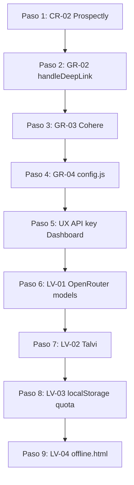

# Plan de Corrección — CR-02 + GR + UX

## Resumen

| ID | Prioridad | Descripción | Archivos |
|----|-----------|-------------|----------|
| CR-02 | 🔴 Crítica | Duplicación de prospectly.js / prospectly-b2b.js / prospectly-auto.js | `js/tools/prospectly*.js`, `index.html` |
| GR-02 | ⚠️ Grave | `handleDeepLink` nunca funciona por check de `CURRENT_USER` | `app.js:2774` |
| GR-03 | ⚠️ Grave | API de Cohere incompatible con formato OpenAI en `callAI` | `app.js:526-554` |
| GR-04 | ⚠️ Grave | `js/config.js` redefine todas las constantes globales | `js/config.js`, `index.html` |
| UX | 🔸 Nueva | "Configura tu API key" persiste en Dashboard tras guardar API key | `app.js:413-425`, `app.js:558-598` |
| LV-01 | 🔸 Leve | Modelos obsoletos en OpenRouter | `app.js:57-69` |
| LV-02 | 🔸 Leve | Proveedor Talvi inexistente | `app.js:57-69` |
| LV-03 | 🔸 Leve | Sin manejo de error `localStorage quota exceeded` | `app.js` (múltiples) |
| LV-04 | 🔸 Leve | Script Ko-fi en offline.html no funciona offline | `offline.html:35` |

---

## Paso 1 — CR-02: Consolidar prospectly.js

### Diagnóstico
- [`js/tools/prospectly.js`](js/tools/prospectly.js) (668 líneas): Implementación original con `ProspectlyB2B` y `AutomatizacionesTool`
- [`js/tools/prospectly-b2b.js`](js/tools/prospectly-b2b.js) (468 líneas): Reesctitura independiente de `ProspectlyB2B` con límites de uso vía localStorage
- [`js/tools/prospectly-auto.js`](js/tools/prospectly-auto.js) (339 líneas): Reesctitura independiente de `AutomatizacionesTool` con límites de uso vía localStorage
- En [`index.html`](index.html:3055) se cargan los 3: `<script src="/js/tools/prospectly.js">` → `<script src="/js/tools/prospectly-b2b.js">` → `<script src="/js/tools/prospectly-auto.js">`
- El último en cargarse **sobrescribe** `window.ProspectlyB2B` y `window.ProspectlyAuto`

### Acciones
1. Identificar diferencias entre `prospectly.js` y `prospectly-b2b.js` (features únicas en el duplicado: límites de uso con localStorage, diferente UI)
2. Integrar las diferencias relevantes en `prospectly.js`
3. Eliminar archivos `prospectly-b2b.js` y `prospectly-auto.js`
4. Eliminar sus `<script>` tags de [`index.html`](index.html:3055)

**Archivos a modificar:** [`js/tools/prospectly.js`](js/tools/prospectly.js), [`index.html`](index.html:3055)
**Archivos a eliminar:** [`js/tools/prospectly-b2b.js`](js/tools/prospectly-b2b.js), [`js/tools/prospectly-auto.js`](js/tools/prospectly-auto.js)

---

## Paso 2 — GR-02: Fix handleDeepLink

### Diagnóstico
En [`app.js:2774-2780`](app.js:2774):

```javascript
function handleDeepLink(){
  const p=new URLSearchParams(location.search);
  const view=p.get('view');
  const idParam=p.get('id');
  // NOTA: CURRENT_USER nunca se define en ningún lugar
  // if (view && [...].includes(view) && CURRENT_USER) goTo(view);
  if (view && ['crm','prop','lib','teams','ws','settings'].includes(view)) goTo(view);
  if (idParam) openClientView(idParam);
}
```

El código ya NO tiene el check de `CURRENT_USER` (fue corregido durante CR-01 al migrar el script). La función actual ya es correcta. Sin embargo, **nunca se llama** en el boot sequence.

### Acciones
1. Añadir llamada a `handleDeepLink()` en el boot sequence de [`index.html`](index.html:2733-2738), después de `applyTranslations()` y antes de `launchApp()`:
   ```javascript
   if (S.get('demo_user')) { launchApp(); } else { checkCookieConsent(); }
   handleDeepLink();
   ```
   O mejor: dentro de `launchApp()` al final.

**Archivos a modificar:** [`app.js:146`](app.js:146) (añadir `handleDeepLink()` al final de `launchApp`)

---

## Paso 3 — GR-03: Fix Cohere API en callAI

### Diagnóstico
En [`app.js:526-554`](app.js:526), la función `callAI` asume formato OpenAI (`/v1/chat/completions`) para todos los proveedores no-Anthropic. Pero Cohere usa `api.cohere.com/v2/chat` con estructura de request/response diferente.

```javascript
// Formato actual (asume OpenAI para todos menos anthropic)
const body = { model: prov.model, messages: [...], max_tokens: maxTokens };
const res = await fetch(prov.endpoint, { ... body: JSON.stringify(body) ... });
```

### Acciones
1. Añadir un case especial para `cfg.provider === 'cohere'` en `callAI`
2. Usar formato Cohere v2 API: `{ model, message, preamble, max_tokens }`
3. Ajustar el endpoint de Cohere en `PROVIDERS` a `https://api.cohere.com/v2/chat`
4. Adaptar el parseo de respuesta (Cohere devuelve `result.response` en vez de `choices[0].message.content`)

**Archivos a modificar:** [`app.js:526-554`](app.js:526)

---

## Paso 4 — GR-04: Consolidar js/config.js

### Diagnóstico
[`js/config.js`](js/config.js) redefine: `PLANS`, `USER_PLAN`, `tierSystem`, `S`, `PROVIDERS`, `SUPPORTED_LANGS`, `LANG`, `MANUAL_API_KEY`. Todas ya existen en [`app.js`](app.js).

Actualmente [`index.html`](index.html) no carga `js/config.js` (no hay `<script src="/js/config.js">` en el HTML).

### Acciones
1. Verificar que `js/config.js` no se carga desde ningún lado (no está en `index.html`, no está en `sw.js`)
2. Si no se usa, **eliminarlo**
3. Si contiene valores útiles que no están duplicados, extraerlos e integrarlos en `app.js`

**Archivos a modificar/eliminar:** [`js/config.js`](js/config.js)

---

## Paso 5 — UX: Ocultar "Configura tu API key" del Dashboard

### Diagnóstico
En [`app.js:2899-2930`](app.js:2899), `renderDashNextAction()` comprueba el badge:
```javascript
const apiOk = document.getElementById('api-status-badge')?.classList.contains('api-ok');
```

El badge se actualiza en:
- [`applyUserSettings()`](app.js:366): `updateApiStatusBadge(cfg.apiKey ? 'ok' : 'no')` ✅
- [`saveApiSettings()`](app.js:423): `updateApiStatusBadge(cfg.apiKey ? 'ok' : 'no')` ✅
- [`testApiKey()`](app.js:409): `updateApiStatusBadge('ok')` ✅

Pero `renderDashNextAction()` SOLO se llama una vez en `initP3()` (con setTimeout de 600ms). **No se vuelve a llamar** cuando el usuario guarda la API key y vuelve al Dashboard.

### Acciones
1. Añadir `renderDashNextAction()` al final de [`refreshDash()`](app.js:558) (se ejecuta cada vez que se navega al Dashboard)
   ```javascript
   function refreshDash() {
     // ... código existente ...
     renderDashNextAction(); // <-- añadir al final
   }
   ```
2. Añadir `renderDashNextAction()` al final de [`saveApiSettings()`](app.js:413)
   ```javascript
   function saveApiSettings() {
     // ... código existente ...
     renderDashNextAction(); // <-- añadir después del toast
   }
   ```

**Archivos a modificar:** [`app.js:558`](app.js:558) y [`app.js:413`](app.js:413)

---

## Paso 6 — LV-01: Limpiar modelos de OpenRouter

### Diagnóstico
En [`app.js:57-69`](app.js:57) (PROVIDERS.openrouter.models), modelos obsoletos:
- `gpt-neo-2.7B` (EleutherAI — obsoleto)
- `bloom-3b` (obsoleto)
- `huggingface/gpt-j-6B` (obsoleto)
- `oobabooga/ostar-2.3b-next` (nunca existió)
- `oobabooga/koala-13b` (obsoleto)
- `OpenAssistant/oa-gpt-4.1-mini` (no existe)
- `OpenAssistant/oa-gpt-4.1` (no existe)
- `nousresearch/Nous-Hermes-13b` (obsoleto)

### Acciones
1. Eliminar los modelos obsoletos de la lista
2. Añadir modelos actuales de OpenRouter (opcional, solo si hay lista actualizada disponible)
3. Mantener ~3-4 modelos populares funcionales

**Archivos a modificar:** [`app.js:57-69`](app.js:57)

---

## Paso 7 — LV-02: Verificar proveedor Talvi

### Diagnóstico
En [`app.js:57-69`](app.js:57): `talvi` con endpoint `https://api.talvi.ai/v1/chat/completions` y modelos `talvi-3b`, `talvi-7b`, `talvi-13b`, `talvi-70b`. No corresponde a ningún proveedor real conocido.

### Acciones
1. Eliminar el proveedor `talvi` del objeto `PROVIDERS` (reduciendo de 11 a 10 proveedores)
2. O reemplazar con un proveedor real alternativo

**Archivos a modificar:** [`app.js:57-69`](app.js:57)

---

## Paso 8 — LV-03: Manejar localStorage quota exceeded

### Diagnóstico
En múltiples lugares, `localStorage.setItem()` está en try/catch con catch **vacíos**. Cuando se excede la cuota (~5-10MB), los datos se pierden silenciosamente.

### Acciones
1. Crear función helper `safeSetItem(key, value)` en [`app.js`](app.js) que:
   - Intente `localStorage.setItem(key, value)`
   - Si lanza `QuotaExceededError`, muestre un toast de advertencia y ofrezca opciones de exportación
2. Reemplazar `localStorage.setItem()` en los catch vacíos por esta función
3. O al menos añadir notificación en los catch de `S.set()` (el wrapper principal de localStorage)

**Archivos a modificar:** [`app.js:51-56`](app.js:51) (función `S.set`)

---

## Paso 9 — LV-04: Fix offline.html Ko-fi script

### Diagnóstico
[`offline.html:35`](offline.html:35): `<script src='https://storage.ko-fi.com/cdn/scripts/overlay-widget.js'></script>` — se carga incluso cuando el usuario está offline.

### Acciones
1. Envolver el script en un condicional que solo lo cargue si hay conexión:
   ```html
   <script>
   if (navigator.onLine) {
     var s = document.createElement('script');
     s.src = 'https://storage.ko-fi.com/cdn/scripts/overlay-widget.js';
     document.head.appendChild(s);
   }
   </script>
   ```
   O simplemente eliminar el script de la página offline.

**Archivos a modificar:** [`offline.html`](offline.html:35)

---

## Diagrama de flujo: Orden de ejecución



---

## Resumen de archivos afectados

| Archivo | Acción |
|---------|--------|
| [`app.js`](app.js) | Modificar: `callAI` (Cohere), `refreshDash`, `saveApiSettings`, `handleDeepLink`/`launchApp`, `PROVIDERS` (Talvi, OpenRouter), `S.set` (quota) |
| [`index.html`](index.html:3055) | Eliminar script tags de prospectly-b2b.js y prospectly-auto.js |
| [`js/tools/prospectly.js`](js/tools/prospectly.js) | Modificar: integrar features de las versiones duplicadas |
| [`js/tools/prospectly-b2b.js`](js/tools/prospectly-b2b.js) | **ELIMINAR** |
| [`js/tools/prospectly-auto.js`](js/tools/prospectly-auto.js) | **ELIMINAR** |
| [`js/config.js`](js/config.js) | **ELIMINAR** (si no se usa) |
| [`offline.html`](offline.html:35) | Modificar: condicionar script Ko-fi |
